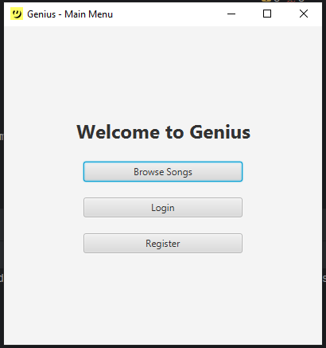
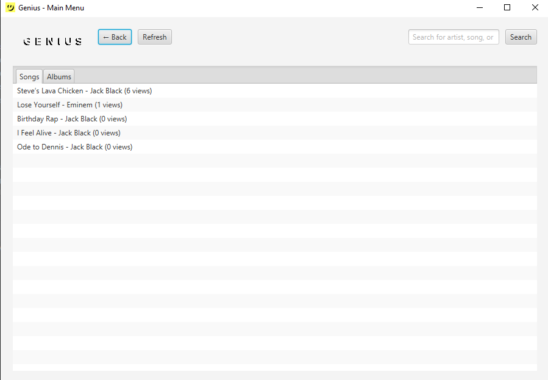
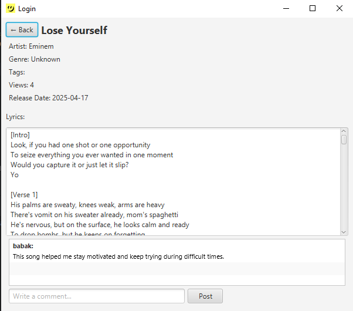
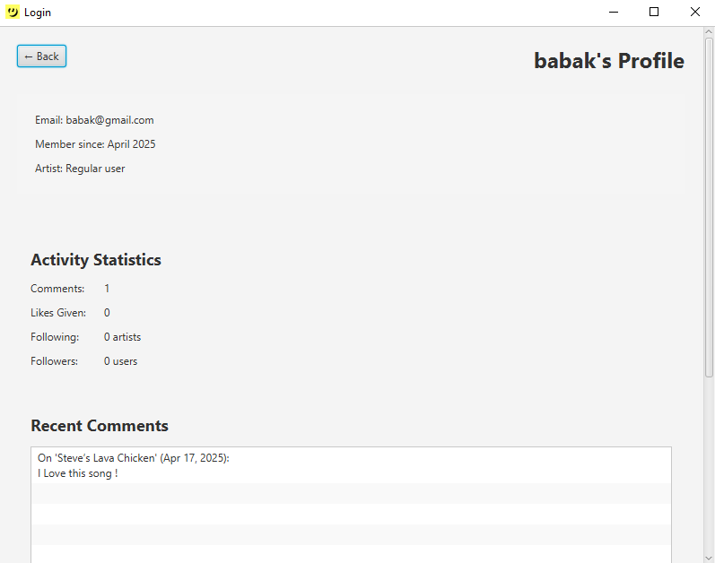
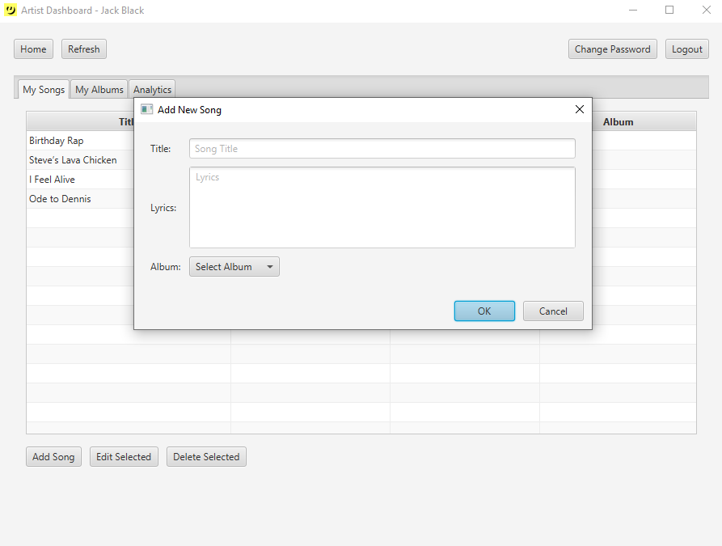

# 🎵 Genius - Music-Lyrics-Platform

I made this app for my Nowruz-Project in Advanced Programming course at SBU university.
I started by learning javafx and then building a simple login and register app. Then I added different roles for users and brick by brick I made this app. So without anymore stories lests dive into it!
## 📖 Table of Contents
- [Description](#-description)
- [Features](#-features)
- [Getting Started](#-getting-started)
    - [Prerequisites](#prerequisites)
    - [Installation](#installation)
- [Usage](#-usage)
    - [For Users](#for-users)
    - [For Artists](#for-artists)
    - [For Admins](#for-admins)
- [Screenshots](#-screenshots)
- [Tech Stack](#-tech-stack)
- [Contributors](#-contributors)
- [Contact](#-contact)

---

## 🌟 Description
**Genius** is a JavaFX-based music platform where users can explore songs, artists can showcase their work, and admins can manage the community. Whether you're here to discover new music, share your creations, or moderate content, Genius is for everyone!

Key highlights:
- 🎶 Browse songs and albums
- ✍️ Submit lyrics and edits
- 🎤 Apply to become a verified artist
- 👥 Share your ideas or feeling about the song with admin

---

## ✨ Features
- **User Roles**:
    - 👨‍💼 **Admins**: Manage users, approve artist applications, ban Users, Promote/Demote Users
    - 🎤 **Artists**: Upload songs/albums, view analytics(not complete)
    - 👤 **Users**: Browse content, comment, follow artists(not complete)

- **Music Management**:
    - Upload and organize songs into albums
    - Track views and popularity
    - Comment on songs

- **Community**:
    - Artist verification system
    - User profiles with activity stats
    - Follow your favorite artists(not complete)

---

## 🚀 Getting Started

### Prerequisites
- Java 11+ JDK
- JavaFX SDK
- Basic understanding of Java

### Installation
1. Clone the repository:
   ```bash
   git clone https://github.com/Sadra3st/Genius-with-Javafx.git
   ```
2. Open the project in your favorite Java IDE (I used IntelliJ for building it)
3. Set up JavaFX SDK in your IDE
4. Run `Main.java` to start the application

---

## 🎧 Usage

### For Users
1. Register or log in
2. Browse songs and albums
3. Click on any song to view lyrics and comments
4. Search to find your favorite song/album/artist

### For Artists
1. Register and apply for artist status
2. Once approved, access your dashboard
3. Upload songs and create albums
4. Track your stats and grow your audience

### For Admins
1. Log in with admin credentials (default: admin/admin123)
2. Manage user accounts
3. Review and approve artist applications
4. Moderate content

---

## 📸 Screenshots
  
 

*First thing you will see after opening the app*



*You can see songs and albums and search*



*You can read the lyrics and add comment*



*You can see your statics and activities in your profile*



*Artists can add songs to their albums*


---

## 💻 Tech Stack
- **Frontend**: JavaFX
- **Backend**: Pure Java
- **Data Storage**: Serialization to files
- **Dependencies**:
    - JavaFX SDK
    - JUnit (for testing)

---

## 👥 Contributors
- [Soroush Saberi](https://github.com/Soroushsbr) - My mentor 🎅


---

## 📜 Changelog(last 4 versions)
### v1.4.0 (Current)
- Search system fixed
- Genius logo added

### v1.3
- Refresh option added to home
### v1.2
- User profile added
- Album storage added
- Now you can add songs to album
### v1.1
- Comment
- Promote/Demote for admin
- Ban users by email for admin
---

## 📩 Contact
Got questions or suggestions? 

- Email: sadra3st@gmail.com
- GitHub: [@sadra3st](https://github.com/Sadra3st)
- Telegram: @Sadra3st

---

<p align="center">
  Made with ❤️ and Java:)))<br>

---

###  P.S
I wanted to add many other features like following,analyzing,customization for profile screen and writing a bio to apply to become an artist and you can 
still see some unused/unfinished code in my project because I wasn't able to do it due to lack of much Java knowledge and limited time.
So if you have any ideas to improve this app feel free to tell me!
